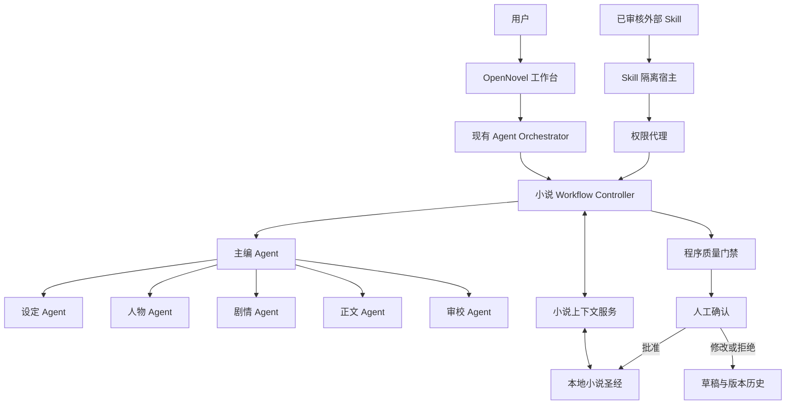
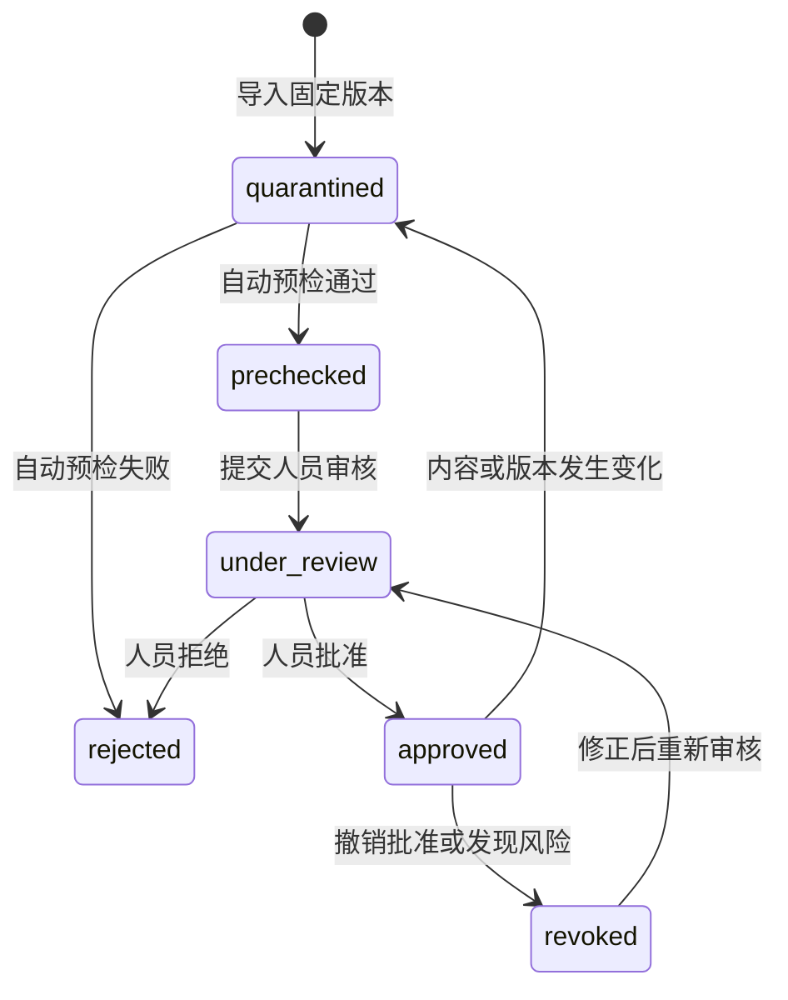

# 多 Agent 小说创作助手架构设计

## 1. 文档状态

- 状态：核心设计与补充产品决策已确认，并已形成全阶段开发计划。
- 目标题材：都市校园、科幻未来，两类题材分别支持，不强制混合。
- 核心能力：丰富背景与人物；依据用户材料生成 1500–3000 字正文；保证基本连贯性并降低明显“AI 味”。
- 人工边界：遇到会改变创作方向的重大歧义时向用户提问；正式正文必须经用户确认；Agent 提出的新设定必须批准后才能成为权威事实。

## 2. 目标与非目标

### 2.1 目标

1. 接收世界观、人物设定、剧情大纲、情节发展和正文大纲，并把它们组织为可检索、可追溯的小说资料。
2. 通过职责清晰的专业 Agent 丰富背景、人物动机、人物关系和成长弧。
3. 生成去除空白与标点后 1500–3000 字的章节正文。
4. 对字数、重复表达、情节因果、人物行为、视角、设定一致性和“AI 味”执行分层检查。
5. 复用现有 Run、审批、取消、检查点和重启恢复能力，让长耗时创作任务可暂停、可恢复、可审计。
6. 允许使用经过人员审核的外部 Skill，同时用软件底层权限边界限制提示注入、数据泄露、恶意代码、供应链篡改和资源耗尽的影响。

### 2.2 非目标

- 首版不让多个 Agent 无约束自由聊天或投票决定正式内容。
- 首版不允许外部 Skill 脚本、二进制、原生扩展或安装钩子执行。
- 首版不让 Agent 自动发布章节、覆盖用户正文或直接修改权威小说资料。
- 首版不依赖向量数据库；先用结构化字段与全文检索证明检索需求。
- 设计不承诺彻底消除“AI 味”或绝对阻止攻击，只定义可测量的质量基线、最小权限和失陷收口边界。

## 3. 核心设计决策

### 3.1 采用混合受控编排

系统采用“主编 Agent + 代码工作流 + 专业 Agent”的混合模式：

- 主编 Agent 持有用户会话的最终控制权，理解意图、选择工作流并汇总结果。
- 专业 Agent 作为边界清晰的能力被调用，不直接接管正式数据和最终答复。
- 章节生产顺序、重试次数、状态转换、审批和写入权限由代码控制。
- 创意判断交给模型，安全与一致性边界交给确定性程序。

该选择符合 OpenAI 对 manager-style 编排的定义：当管理者需要综合专业结果并保持最终答复所有权时，应把专业 Agent 作为受限工具；只有专业者需要接管用户会话时才使用 handoff。[OpenAI：Orchestration and handoffs](https://developers.openai.com/api/docs/guides/agents/orchestration)

### 3.2 现有 Harness 继续作为外层运行权威

现有 `src/agent/` 已具备 Run 状态机、流式执行器边界、持久化、审批、取消和重启恢复。后续实现不替换这些能力，而是在其内部增加真实模型执行器和小说工作流：

- 外层 Orchestrator 负责 durable run、事件顺序、检查点、审批证明与恢复。
- 内层 Workflow Controller 负责一次小说任务中的专业 Agent 调用和质量循环。
- OpenAI Agents SDK 可用于 Agent、工具、结构化输出、guardrail 和模型调用，但不能越过外层状态机直接写正式数据。[OpenAI：Agents SDK](https://developers.openai.com/api/docs/guides/agents)

### 3.3 采用客户端 Provider Registry 与 BYOK

首版不部署 OpenNovel 自有模型中转服务。客户在本机配置自己的 API Key，应用通过供应商无关的 `ModelGateway` 接入三类适配器：

- OpenAI-compatible：支持自定义 HTTPS Base URL 和模型 ID，可连接官方 OpenAI、兼容平台、可选聚合服务或用户自建网关；
- Anthropic：使用原生 Messages API 适配器；
- Gemini：使用原生 Google Generative AI API 适配器。

每个主编、设定、人物、剧情、正文和审校角色绑定 `ModelProfile`，同一作品可以跨平台组合模型。默认禁止静默跨供应商回退；只有用户显式启用并确认数据将发送到另一供应商后才允许。OpenRouter 只视为可选连接，LiteLLM 留作未来团队或企业集中网关，不成为桌面版运行前提。[AI SDK：Providers and Models](https://ai-sdk.dev/docs/foundations/providers-and-models) [AI SDK：Provider Management](https://ai-sdk.dev/docs/ai-sdk-core/provider-management)

断网或模型不可用时，所有本地编辑、资料、版本、搜索、导入和导出继续工作；AI 入口明确显示不可用，不在本地伪造模型结果。

## 4. 总体架构

## 5. 组件职责

### 5.1 主编 Agent

- 将用户请求分类为设定共创、人物共创、正文生成、正文修改或咨询。
- 判断是否存在会改变剧情方向的重大歧义；只有满足该条件才触发提问。
- 选择需要调用的专业 Agent，不把全部 Agent 固定运行一遍。
- 整合专业结果，向用户展示来源、重要取舍和待确认内容。
- 不直接保存正式正文或权威设定。

### 5.2 设定 Agent

- 分析世界规则、地点、组织、校园或社会结构、技术规则和能力边界。
- 对都市校园重点检查家庭、学校制度、社团、城市区域、阶层和现实关系。
- 对科幻未来重点检查技术原理、资源限制、社会代价、法律伦理和能力边界。
- 新增内容只输出为 `SettingProposal`，不得直接成为事实。

### 5.3 人物 Agent

- 补全人物目标、动机、恐惧、缺陷、秘密、关系张力、成长弧和语言特征。
- 检查人物行为是否与已确认动机匹配。
- 避免只堆标签、人物口吻一致、人人拥有相似悲惨过去，以及新增能力没有代价。
- 新增内容只输出为 `CharacterProposal`。

### 5.4 剧情 Agent

- 把剧情大纲与正文大纲转为结构化章节蓝图。
- 明确每个场景的目标、冲突、转折、结果、参与人物、时间地点和章末钩子。
- 检查情节因果、必要事件覆盖和伏笔状态，不负责生成最终正文。

### 5.5 正文 Agent

- 根据已确认的 `ChapterBlueprint` 和裁剪后的小说上下文生成正文。
- 遵循用户风格档案、角色口吻、视角和禁用表达。
- 不擅自改变世界规则；草稿中新出现的事实必须同时产生 `CanonChangeProposal`。

### 5.6 审校 Agent 与程序门禁

- 程序门禁检查字数、空输出、必需事件、重复片段、版本状态和结构化契约。
- 审校 Agent 检查情节因果、人物动机、视角、时间线、设定一致性、对白区分和明显“AI 味”。
- 审校输出必须包含问题位置、严重度、理由和可执行修订建议，不允许只返回笼统分数。

### 5.7 小说上下文服务

- 根据任务检索最小必要资料，而不是把整本小说和全部聊天记录放入提示词。
- 返回资料 ID、版本、状态和来源，确保 Agent 能区分权威事实、用户草稿和待批准提案。
- 对正文生成优先提供当前人物、相关世界规则、最近章节摘要、时间线窗口、活动剧情线和待回收伏笔。

## 6. Agent 间结构化契约

Agent 间不得用自由文本隐式传递指令。首版至少需要下列严格 schema：

- `SettingProposal`：提案内容、依据、影响对象、潜在冲突、建议状态。
- `CharacterProposal`：人物字段变化、动机依据、关系影响、成长节点、冲突列表。
- `ChapterBlueprint`：章节目标、目标字数、视角、时间地点、场景列表、必需事件、禁止内容、章末钩子。
- `DraftChapter`：正文、实际字数、使用的蓝图版本、引用的权威资料版本、新事实提案。
- `ReviewReport`：硬规则结果、问题列表、严重度、位置、建议、是否建议修订。
- `CanonChangeProposal`：事实类型、旧值、新值、来源章节、影响范围。
- `SkillInvocationRequest`：Skill 版本、任务目的、最小数据范围、所需能力、预算。

所有 schema 在进入下一节点和持久化前执行严格运行时校验。无效输出只允许一次定向结构修复；仍无效则当前步骤失败。

## 7. 核心工作流

### 7.1 丰富背景与人物

1. 读取用户提供的世界观、人物设定和剧情资料；用户明确输入的内容直接标记为权威来源。用户明确表示“修改原设定”时创建替代版本；新输入与旧事实冲突但修订意图不明确时，暂停并询问，不擅自选择新旧版本。
2. 小说上下文服务检测空白、重复、矛盾和可延展点。
3. 设定 Agent 与人物 Agent 仅处理相关部分，可在彼此无依赖时并行。
4. 主编 Agent 合并少量高价值提案，标明依据、影响范围和潜在冲突。
5. 用户批准的提案进入小说圣经；未批准提案保留在暂存区或被拒绝。
6. 正式写入产生新版本和审计记录，不覆盖旧版本。

### 7.2 生成章节正文

1. 校验正文大纲、目标字数、视角、必须出现与禁止内容。
2. 若缺失信息会显著改变剧情方向，Run 进入待询问状态；一般细节由系统依据已确认资料作保守选择。
3. 检索当前章节所需人物、设定、时间线、伏笔和相邻章节摘要。
4. 剧情 Agent 生成 `ChapterBlueprint`。
5. 正文 Agent 生成 `DraftChapter`，默认按去除空白和标点后的正文字符计数。
6. 程序门禁和审校 Agent 执行双层检查。
7. 未通过时把具体问题交给正文 Agent 修订，最多两轮；禁止无限自循环。
8. 两轮后仍未通过时，把草稿、缺陷清单和建议交给用户，不伪装成合格正文。
9. 最终确认界面同时展示正文版本差异和本章引入的全部新事实；用户确认正文即确认已展示的新事实。若正文可接受但某项新事实被拒绝，流程回到定向修订，不能带着矛盾状态写入。
10. 用户确认后保存正式版本，并在同一受控提交中更新章节摘要、相关时间线和伏笔状态。
11. 用户拒绝或修改时，正文保留为草稿或新版本，不产生权威事实写入。

## 8. 小说圣经与本地存储

### 8.1 权威资料模型

- 作品档案：题材、受众、主题、叙事视角、基调、文风样本、禁用表达。
- 世界设定：时代、地点、组织、社会结构、科技或能力规则、限制与代价。
- 人物档案：身份、目标、动机、缺陷、秘密、关系、成长弧、说话习惯。
- 时间线：发生时间、地点、参与人物、前因后果、后续影响。
- 剧情与伏笔：主线、支线、阶段目标、冲突、埋设、回收条件和状态。
- 章节与场景：正文版本、摘要、场景目标、出场人物、新事实和修改记录。

### 8.2 资料状态

- `user_confirmed`：用户明确输入的权威内容。
- `proposed`：Agent 或 Skill 提案，不能约束正文。
- `approved`：经用户确认后可用于后续生成。
- `superseded`：被新版本取代，仍保留历史与引用关系。
- `rejected`：拒绝采用，不能被上下文服务检索为事实。

### 8.3 存储策略

- 小说业务数据使用本地 SQLite，正式写入使用事务。
- 正文、提案和权威资料均保留版本与来源，不做原地无历史覆盖。
- 首版使用精确字段、关系查询和全文检索；只有数据量和评测证明有必要时才加入向量检索。
- 模型会话状态不是权威记忆。API 对话延续只用于当前交互，小说事实必须回到本地资料层。[OpenAI：Conversation state](https://developers.openai.com/api/docs/guides/conversation-state)

### 8.4 项目文件与导入导出

- 每部小说保存到用户选择的独立目录，包含 `open-novel.json`、`project.sqlite3`、attachments、backups 和 exports。
- `project.sqlite3` 是正文和小说圣经的唯一权威数据源，不自动双写可编辑 Markdown，以免产生两个冲突来源。
- 应用级控制数据库只保存最近项目、非敏感 Provider 配置、Model Profile 和 Skill 审核记录；API Key 使用 Electron `safeStorage` 加密后单独保存，项目和备份中只出现不可反解的引用 ID。[Electron：safeStorage](https://www.electronjs.org/docs/latest/api/safe-storage)
- 首版支持粘贴、TXT 和 Markdown 导入；支持 TXT、Markdown、DOCX 和不含密钥的完整项目备份导出。

## 9. 正文质量门禁

### 9.1 硬规则

- 去除空白和标点后为 1500–3000 个正文字符。
- 正文非空，章节蓝图的必要事件全部出现。
- 角色身份、关键时间地点、叙事视角和权威规则不存在严重冲突。
- 只有带持久化人工确认记录的正文才能进入正式版本。

### 9.2 连贯性规则

- 场景之间存在可理解的因果或时间过渡。
- 人物行为与目标、动机、已知信息和关系状态相符。
- 新信息有合理来源，不以旁白强行补丁替代铺垫。
- 对话能区分人物，不出现所有角色共用同一种语气。

### 9.3 “AI 味”检查

- 高频词、重复短语和连续相似片段。
- “不是……而是……”、模板化转折、空泛抒情和段末总结等句式的过度集中。
- 句长、段长和句法结构过度整齐。
- 修饰词密度过高、感官描写泛化、同义反复或解释已经表达清楚的内容。
- 人物对白同质化、冲突被快速讲解而非通过行动展现。

程序检测负责定位重复与统计信号，审校 Agent 负责语义判断。单个统计信号只触发复核，不能机械删除正常的角色名、专有名词和有意复沓。

### 9.4 编辑器 AI 与生成模式

正文使用基于 CodeMirror 6 的纯文本编辑器，支持章节树、中文输入法、自动保存、搜索替换、字数、撤销重做和版本恢复。选中文本后可以提问、润色、改写、扩写、缩写、加强对话、加强描写或修复问题；提问只写入侧栏，其他操作先生成绑定原文哈希与版本的候选差异，用户点击替换或插入后才修改正文。[CodeMirror：Documentation](https://codemirror.net/docs/)

用户可选择三种固定成本/质量模式：

- 快速：正文 Agent 加程序硬门禁，不做自动语义修订；
- 标准：章节蓝图、正文与审校，最多一轮自动修订，作为默认模式；
- 深度：按需调用设定、人物和剧情 Agent，再执行正文与审校，最多两轮自动修订。

所有模式都必须满足正式正文的字数和人工确认门禁；快速模式不会降低正式数据安全标准。

## 10. 异常处理与恢复

- 网络或模型失败：只对可重试错误有限退避重试；仍失败则停在当前检查点。
- 无效结构化输出：允许一次定向修复；失败后返回明确错误，不写入残缺对象。
- 字数或质量失败：最多两轮正文修订；之后由用户决定。
- 设定冲突或重大歧义：暂停并展示冲突来源、版本和影响范围。
- 用户取消：通过 `AbortSignal` 终止活动调用，保留已持久化检查点。
- 应用重启：依靠现有 Orchestrator 恢复 Run、草稿、事件序号和审批状态。
- 写入失败：SQLite 事务整体回滚，正文确认与权威资料更新不得出现半成功。
- 外部 Skill 失败：回退核心 Agent 流程；Skill 结果不得污染正式数据。

## 11. 外部 Skill 人员审核与隔离

### 11.1 威胁模型

从 GitHub 获取的 Skill 一律视为不可信供应链，可能包含：

- 试图覆盖主编或系统规则的提示注入；
- 引导模型泄露小说、密钥或本地数据的指令；
- 恶意脚本、二进制、原生扩展、安装钩子、符号链接和路径穿越；
- 未声明联网、越权读写、资源耗尽或数据投毒；
- 上游仓库更新后的供应链篡改。

OpenAI 建议不要把不可信变量放入高优先级指令，跨节点使用结构化输出并保留工具审批；结构化和隔离能降低风险，但不能完全消除提示注入。[OpenAI：Safety in building agents](https://developers.openai.com/api/docs/guides/agent-builder-safety)

### 11.2 强制状态机

任何非 `approved` 状态，或内容哈希与批准记录不一致的 Skill，都不能出现在可调用列表。

单用户桌面版默认由作品所有者执行人员审核，并在本地保存稳定的审核人标识；未来如增加受管理工作区，可把审核权限定给管理员或指定审核组，但不能把模型判断等同于人员审核。

### 11.3 审核记录

批准记录必须绑定：

- 仓库地址、作者、许可证、Git commit 和完整内容哈希；
- 自动预检结果、全部文件清单、Skill 引用的本地参考文件和人员风险备注；
- 允许读取的数据范围、网络目标、模型预算和输出类型；
- 审核人、审核时间、结论、限制条件和权限快照。

远端更新只提示，不自动安装。新 commit 是独立版本，旧批准不得继承。批准被撤销后，禁止新调用，活动调用在安全检查点取消并保留审计记录。

### 11.4 首版仅开放声明式 Skill

首版允许：

- `SKILL.md` 中经过审核的说明、参考资料、示例和结构化规则；
- 用于文风检查、人物模板、剧情审查和表达重复检查的纯数据资产。

首版拒绝：

- 任意脚本执行、Shell、子进程、原生模块、Electron 或 Node API；
- 二进制、安装钩子、符号链接、动态下载和未声明网络访问；
- 未纳入当前版本哈希和审核清单的外部链接内容；外部资料必须单独导入、固定版本并审核后才能使用。

外部 Skill 内容只能作为不可信用户数据传给专用 Agent，不能拼入系统或开发者指令。其输出必须通过固定 schema，并且只能进入提案暂存区。

### 11.5 权限代理

隔离宿主没有直接能力，所有资源访问经过默认拒绝的 Capability Broker：

- 小说数据：只读取当前任务所需最小片段；无正式数据直写权限。
- 文件系统：不暴露真实路径；声明式 Skill 不拥有文件 API。
- 网络：默认断网；未来按 Skill、域名和单次任务授权，并限制方法、大小、超时和重定向。
- 密钥：API Key 永不传给 Skill；模型调用由核心运行时代理。
- 资源：限制 token、并发、运行时间、输出大小和累计预算。
- 结果：先做 schema、长度和策略校验，再由主编与人工确认决定是否采用。

### 11.6 后续可执行 Skill

可执行 Skill 不得在 Electron 主进程、预加载或渲染进程中直接运行。只有引入独立进程身份、OS 级隔离、资源配额和受控 IPC 后才允许设计实施。

Node 官方明确说明 Permission Model 是防误操作的“安全带”，不能抵御恶意代码，因此 `--permission` 只能作为纵深防御，不能充当不可信代码沙箱。[Node.js：Permissions](https://nodejs.org/api/permissions.html)

## 12. 安全与隐私

- API 密钥只在主进程内通过 Electron `safeStorage` 解密；渲染进程、项目数据库、备份、导出和日志不可读取明文。Windows DPAPI 不能抵御同一系统用户权限下已运行的恶意程序，产品说明不得把它描述为绝对安全。
- 继续保持 Electron `contextIsolation`、sandbox、关闭 Node integration 和固定 IPC 白名单；所有 IPC 请求校验 sender、参数和状态。[Electron：Security](https://www.electronjs.org/docs/latest/tutorial/security)
- 默认日志记录 Run ID、Agent、步骤、状态、耗时、token、Skill 版本和权限决策，不记录完整正文、密钥或模型原始推理。
- 开启远程 tracing 前必须提示创作内容可能进入远程追踪；默认关闭敏感输入输出采集。
- 正式写入、外部网络、权限扩大和 Skill 启用均保留可审计记录。
- 对提示注入、越权读写、路径穿越、数据外泄和资源耗尽执行安全评测与红队测试。[OpenAI：Red teaming](https://developers.openai.com/api/docs/guides/red-teaming)

## 13. 测试与评测

### 13.1 自动化测试

- Agent schema 的严格校验、额外字段拒绝和不可信对象隔离。
- 小说圣经状态转换、来源、版本和事务回滚。
- 字数算法、重复片段检测、必要事件检查和误报豁免。
- 上下文最小化、权威状态筛选和版本一致性。
- 两轮修订上限、取消、失败、重启和审批证明。
- Skill 状态机、版本哈希、权限快照、更新重审、撤销和审计日志。
- 恶意 Skill、提示注入、路径穿越、越权网络、超大输出和资源耗尽用例。

### 13.2 内容评测集

首版至少准备 12 个代表任务：都市校园与科幻未来各 6 个，覆盖人物对话、矛盾冲突、场景过渡、设定密集、伏笔埋设和伏笔回收。

同一评测输入用于比较提示词、模型和工作流变化。评测记录质量、人工修改量、延迟、token 和成本；只有在质量不下降时，资源减少才算优化。OpenAI 也建议从 trace 定位工具选择、handoff、guardrail 和指令偏差，再用数据集与 eval run 做重复比较。[OpenAI：Evaluate agent workflows](https://developers.openai.com/api/docs/guides/agent-evals)

### 13.3 首版通过标准

- 100% 测试章节满足 1500–3000 字硬规则。
- 不存在未确认正文进入正式版本或未批准提案进入权威资料。
- 测试集不存在人物身份、关键时间线、正文大纲必要事件或已确认世界规则的严重冲突。
- 用户对连贯性、人物可信度、阅读自然度和“无明显 AI 味”四项评分的代表样本平均不低于 4/5。
- 在生成、审校和待确认阶段模拟取消、模型失败和应用重启，均不丢稿、不重复事件、不越过审批。
- 未经人员审核、版本哈希不匹配、批准被撤销或权限越界的 Skill 调用全部被拒绝。

## 14. 分阶段实施建议

正式实施按九个退出门禁推进：基线与测试、独立项目与数据库、编辑器与文件交换、BYOK Model Gateway、小说圣经、受控多 Agent 正文、长期上下文与质量、外部 Skill 隔离、Windows 安装与最终验收。每阶段的接口、文件、任务和通过标准见 [多 Agent 小说创作助手全阶段开发计划](../2026-08-07/多Agent小说创作助手全阶段开发计划.md)。

阶段顺序不可跳过；只有通过前一阶段自动测试和人工验收后才能开始依赖它的阶段。向量检索、可执行 Skill、代码签名和自动升级必须另立计划，不得在首版实现时顺带加入。

## 15. 被否决的替代方案

- 单一 Agent 完成所有任务：实现快，但提示过载、长期一致性和自我审查能力不足。
- 多 Agent 自由编剧室：创意发散强，但成本、状态、复现和正式写入边界不可控；后续可作为纯提案模式。
- 外部 Skill 审核后直接视为可信：人员审核会漏判，不能替代运行时最小权限与隔离。
- 仅使用 Node Permission Model 运行第三方脚本：官方威胁模型不保证抵御恶意代码，不能满足底层隔离要求。

## 16. 完成定义

本设计进入实施计划前，必须满足：

1. 用户确认本文准确反映已批准的架构和安全边界。
2. 文档不存在占位符、互相矛盾的写入规则或未定义的首版范围。
3. 后续实施计划按阶段拆分，任何阶段开始前遵守仓库日期计划和 README 同步约束。
4. 外部 Skill 的人员审核和运行隔离不得作为可选项被后续实现省略。
