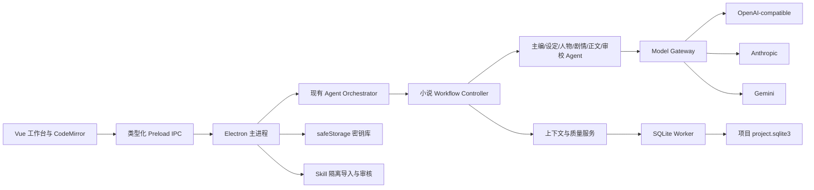

# 多 Agent 小说创作助手全阶段开发计划

> **供 Agent 实施者使用：** 每个阶段开始前必须创建当天的独立修改计划；实施时使用 `superpowers:test-driven-development`，跨多个独立任务时使用 `superpowers:subagent-driven-development` 或 `superpowers:executing-plans`，完成声明前使用 `superpowers:verification-before-completion`。

**目标：** 把现有 Electron Harness 基座建设为 Windows 可安装的本地优先小说创作软件，使用户使用自己的 API Key，通过受控多 Agent 工作流完成都市校园或科幻未来小说的设定、人物、大纲、章节规划与 1500–3000 字正文创作，并把确认后的小说安全保存在本地。

**架构：** 保留现有 Orchestrator 作为 Run、审批、取消、检查点和恢复的外层权威；新增供应商无关的 Model Gateway、小说领域与上下文服务、确定性 Workflow Controller 和职责明确的专业 Agent。作品权威数据保存在用户选择的独立项目文件夹中，API Key 与外部 Skill 审核记录保存在应用级安全控制层，所有 AI 结果先成为候选内容，未经用户确认不得覆盖正文或写入权威设定。

**技术栈：** Electron 43、Vue 3、TypeScript 6、electron-vite、Electron 内置 Node 24 `node:sqlite`、Vercel AI SDK、CodeMirror 6、Zod、docx、electron-builder NSIS、Node Test Runner、Vitest 与现有 Electron smoke 工具。

## 全局约束

- 仅支持 Windows 10/11 x64；V1 交付未签名、无自动升级的小范围测试安装包。
- 断网时项目管理、编辑、搜索、版本、导入和导出必须可用；任何 AI 生成功能明确不可用且不得伪造结果。
- 支持 OpenAI-compatible、Anthropic、Gemini 三类适配器；客户使用自己的 API Key；OpenRouter 只能作为可选 OpenAI-compatible 连接，LiteLLM 留作未来团队网关。
- 默认禁止跨供应商静默回退；只有用户在角色绑定中显式启用并确认数据路由与费用影响后才可使用回退模型。
- 每部小说使用独立项目文件夹；V1 导入 TXT、Markdown 和粘贴文本，导出 TXT、Markdown、DOCX 与不含 API Key 的项目备份包。
- 正文使用纯文本编辑器；选区 AI 结果进入候选差异视图，只有用户明确执行替换或插入才修改正文。
- 正文章节按去除 Unicode 空白与标点后的字符数计算，合格范围为 1500–3000 字；质量修订最多两轮。
- 所有 Agent 新增设定只生成提案；用户批准后才能进入小说圣经。用户确认最终正文时必须同时确认该版本披露的新事实。
- 外部 Skill 必须固定版本、自动预检、人员审核后才能启用；V1 只接受声明式文本与结构化资料，禁止执行脚本、二进制、安装钩子、Shell、Node/Electron API 和任意文件或网络访问。
- 不引入向量数据库、云端账户、云同步、多人协作、自动发布、可执行 Skill、EPUB 或 DOCX 导入。
- 遵守根目录 `AGENTS.md`：每个改动先建计划，每个受维护目录有 README，同目录文件修改时同步 README，提交前运行 `npm run check:readmes`。

---

## 1. 已确认方案与市场做法

### 1.1 多模型接入方式

市场上常见三种做法：客户端内置统一 Provider Registry、部署独立模型网关、使用聚合平台。OpenNovel V1 选择第一种，避免用户必须部署额外服务或把全部请求交给聚合商；业务层只依赖自有 `ModelGateway`，底层用 AI SDK 统一文本流、结构化输出和取消语义。AI SDK 官方提供供应商统一接口、Provider Registry、OpenAI-compatible、Anthropic 与 Google provider，适合当前三类适配器。[AI SDK Providers](https://ai-sdk.dev/docs/foundations/providers-and-models) [Provider Management](https://ai-sdk.dev/docs/ai-sdk-core/provider-management)

- OpenAI-compatible：用户填写连接名称、HTTPS Base URL、API Key 与模型 ID；允许官方 OpenAI、兼容服务、OpenRouter 或自建网关。
- Anthropic：使用原生 Messages API provider，保留其结构化输出和供应商参数差异。
- Gemini：使用原生 Google Generative AI provider，保留其结构化输出和安全设置差异。
- 将来需要集中预算、限流和团队审计时，可在不改业务契约的情况下增加 LiteLLM/OpenRouter/企业网关连接。

### 1.2 本地数据与密钥

- Electron 运行时已经验证可使用 `node:sqlite`，数据库操作放入 Worker，避免同步 SQLite 阻塞主进程。
- API Key 只在主进程解密和组装请求时短暂出现；使用 Electron `safeStorage` 加密后的字节保存到应用数据目录，渲染进程、项目数据库、备份、导出和诊断日志都不出现明文。[Electron safeStorage](https://www.electronjs.org/docs/latest/api/safe-storage)
- Windows 下 `safeStorage` 依赖 DPAPI；它能隔离其他系统用户，但不能承诺抵御同一 Windows 用户权限下已经运行的恶意程序。设置页必须如实说明该边界。

### 1.3 编辑器与安装包

- CodeMirror 6 提供可组合扩展、选区、事务、只读状态与搜索能力，适合作为纯文本编辑内核；AI 浮动工具栏、候选差异、中文段落行为和自动保存由项目代码实现。[CodeMirror Documentation](https://codemirror.net/docs/)
- Windows 测试版使用 electron-builder 生成 x64 NSIS 离线安装器；采用辅助安装、当前用户安装并允许选择安装目录。NSIS 是 electron-builder 的 Windows 默认安装目标，并支持安装与卸载配置。[electron-builder NSIS](https://www.electron.build/nsis/)

## 2. 目标架构与公共契约



### 2.1 本地目录契约

每部小说目录固定为：

```text
作品名/
├── open-novel.json       # 格式版本、项目 ID、书名和创建时间，不含密钥
├── project.sqlite3       # 权威资料、正文版本、Run、审批与审计数据
├── attachments/          # 用户主动导入的文本参考资料
├── backups/              # 事务迁移前和用户手动创建的项目备份
└── exports/              # TXT、Markdown、DOCX 成品
```

- `project.sqlite3` 是唯一权威数据源，不对同一章节同时维护一份自动双写 Markdown。
- `open-novel.json` 通过临时文件加原子替换写入；项目打开时创建进程锁，陈旧锁可在确认后恢复。
- 项目迁移前自动备份；数据库启用 foreign keys、WAL、`busy_timeout` 和 `user_version` 迁移。
- 应用级 `control.sqlite3` 保存最近项目、Provider 非敏感配置、Model Profile、Skill 元数据和审核记录；加密密钥文件单独保存。
- 项目备份包含 manifest、项目数据库和 attachments，不包含应用级配置、API Key、缓存、日志或 exports。

### 2.2 核心 TypeScript 类型

公共类型统一放在 `src/shared/`，主进程、preload、renderer 和测试不得复制自定义变体。

```ts
type ProviderKind = 'openai-compatible' | 'anthropic' | 'gemini'
type AgentRole = 'editor' | 'setting' | 'character' | 'plot' | 'writer' | 'reviewer'
type GenerationMode = 'quick' | 'standard' | 'deep'
type ModelCapability = 'stream-text' | 'structured-output' | 'tools' | 'usage'

interface ProviderConnection {
  id: string
  name: string
  kind: ProviderKind
  baseUrl?: string
  secretRef: string
  enabled: boolean
}

interface ModelProfile {
  id: string
  connectionId: string
  label: string
  modelId: string
  temperature: number
  maxOutputTokens: number
  contextWindow: number
  capabilities: ModelCapability[]
}

interface AgentRoleBinding {
  role: AgentRole
  mode: GenerationMode
  primaryProfileId: string
  fallbackProfileIds: string[]
  allowCrossProviderFallback: boolean
}
```

Model Gateway 必须提供以下稳定接口；供应商 SDK 类型不得泄漏到 `src/agent/`、`src/novel/` 或 renderer：

```ts
interface ModelGateway {
  testConnection(connectionId: string, modelId: string, signal: AbortSignal): Promise<ConnectionTestResult>
  streamText(request: TextGenerationRequest): AsyncIterable<ModelStreamEvent>
  generateObject<T>(request: StructuredGenerationRequest<T>): Promise<StructuredGenerationResult<T>>
  estimateTokens(request: TokenEstimateRequest): Promise<TokenEstimate>
}
```

- `testConnection` 返回认证、模型可用、流式、结构化输出和用量字段能力，不以“请求成功”假定全部能力。
- `streamText` 统一增量文本、完成、用量、供应商请求 ID 和可重试错误；取消统一由 `AbortSignal` 控制。
- `generateObject` 用 Zod schema 校验；无效结构只允许一次定向修复，第二次失败即终止步骤。
- 网络错误只对 408、409、429 和 5xx 做带抖动的有限退避；认证、余额、模型不存在、内容策略和 schema 错误不盲目重试。

### 2.3 小说与审批契约

必须实现并验证 `SettingProposal`、`CharacterProposal`、`ChapterBlueprint`、`DraftChapter`、`ReviewReport`、`CanonChangeProposal` 和 `SkillInvocationRequest`。所有对象包含 `id`、`projectId`、`sourceRunId`、`schemaVersion`、`createdAt` 和来源版本；状态只允许：

```text
proposed -> approved | rejected
approved -> superseded
```

正文版本使用 `draft`、`candidate`、`confirmed`、`superseded`。只有带持久化 `ApprovalRecord` 的 `confirmed` 版本能更新章节当前正式版本；正文确认与新事实批准在同一 SQLite 事务中完成。

### 2.4 IPC 边界

`window.openNovel` 按领域暴露最小 API：`projects`、`chapters`、`novelBible`、`models`、`agent`、`skills`、`imports`、`exports`。每个 IPC handler 必须复用现有 sender 校验、运行时参数校验、错误规范化和取消机制；renderer 不获得路径遍历、原始数据库、通用 fetch、密钥读取或任意文件 API。

## 3. 分阶段实施

每个阶段是独立审查单元。阶段未达到退出标准，不进入依赖它的后续阶段；每个阶段的计划都要列出精确文件、失败测试、最小实现、验证命令和实际结果。

### 阶段 0：基线冻结与测试骨架

**目标：** 在不改变现有 Harness 行为的前提下，建立后续领域和 UI 测试入口。

**主要文件：** 修改 `package.json`、`tests/README.md`、相关配置 README；新增 `vitest.config.ts` 和渲染测试初始化文件。

**任务：**

- [ ] 保存当前 `npm test`、`npm run typecheck`、`npm run build`、`npm run test:electron-smoke` 与 `npm run check:readmes` 基线结果，区分既有失败与本阶段回归。
- [ ] 保留现有 Node Test Runner 契约测试，新增 Vitest + Vue Test Utils + happy-dom 作为组件测试，不迁移或删除现有测试。
- [ ] 统一脚本为 `test:unit`、`test:ui`、`test:electron-smoke`、`test:acceptance`，让 `npm test` 串行运行 unit 与 UI 测试。
- [ ] 为后续新增目录准备 README 契约测试，确保新增目录先有 README。

**退出标准：** 现有 Harness 全部测试和生产 smoke 保持通过；空白 Vue 组件测试可执行；构建产物行为无变化。

### 阶段 1：独立项目、本地数据库与项目生命周期

**目标：** 用户可以新建、打开、关闭、重命名和备份一部真实保存在自选目录的小说项目。

**主要文件：** 新增 `src/novel/README.md`、`src/novel/project-paths.ts`、`src/novel/schema.ts`、`src/novel/database-worker.ts`、`src/novel/project-repository.ts`；扩展 `src/shared/app.ts`、`src/main/`、`src/preload/` 和 `ProjectCenterView.vue`。

**任务：**

- [ ] 先用测试定义路径规范化、目录占用、manifest 校验、陈旧锁、数据库迁移回滚、最近项目和备份恢复行为。
- [ ] 在 Node Worker 内创建 `DatabaseSync`，实现串行 RPC、事务、迁移、健康检查、关闭和故障传播；主进程退出前等待数据库安全关闭。
- [ ] 建立 `projects`、`project_settings`、`schema_migrations`、`audit_events` 基础表和应用级 `control.sqlite3`。
- [ ] 使用系统文件选择器新建或打开项目；拒绝非空冲突目录、路径穿越、无效 manifest 和同一项目并发写入。
- [ ] 项目中心展示最近项目、缺失路径、最后打开时间和恢复入口；删除最近记录不删除磁盘项目，真正删除项目不纳入 V1。

**退出标准：** 新建项目后重启应用仍能打开；模拟迁移失败能回滚并从备份恢复；两个实例不能同时写同一项目；数据库 Worker 不阻塞渲染交互。

### 阶段 2：章节树、纯文本编辑器、版本与本地文件交换

**目标：** 在没有模型和网络的情况下完成章节写作、自动保存、恢复、导入和导出。

**主要文件：** 新增 `src/shared/chapter.ts`、`src/novel/chapter-service.ts`、`src/export/README.md`、`src/export/import-service.ts`、`src/export/export-service.ts`、`src/renderer/src/components/README.md` 与编辑器组件；替换章节占位页。

**任务：**

- [ ] 创建 `chapters`、`chapter_versions`、`chapter_drafts`、`import_jobs`、`export_jobs` 表，正文版本永不原地覆盖。
- [ ] 集成 CodeMirror 6，支持中文输入法、撤销重做、搜索替换、当前选区、章节切换、只读候选视图和无干扰全屏。
- [ ] 编辑停止 800ms 后自动保存草稿；章节切换、窗口关闭和应用退出前强制 flush；保存失败保留内存稿并持续显示未保存状态。
- [ ] 字数统计统一调用共享 `countChineseProseCharacters`，删除 Unicode 空白与标点后计数，编辑器、导出和质量门禁使用同一实现。
- [ ] TXT/Markdown 导入支持粘贴、作为参考资料、作为单章正文和按 `第…章`/Markdown 标题拆章；导入前预览拆分结果，确认后事务写入。
- [ ] TXT、Markdown 和 DOCX 导出支持整书与按卷组织；标题、章节顺序和正文来自同一个数据库快照。DOCX 使用 `docx` 库，不执行模板宏或外部程序。
- [ ] 项目备份写入临时文件，校验 manifest、SQLite 快速检查和哈希后原子重命名为 `.opennovel.zip`。

**退出标准：** 断网下可连续编辑并恢复 300 章项目；异常关闭后最多丢失 800ms 内尚未落盘的输入；导入预览与实际章节一致；三种导出内容顺序、字数和中文编码一致；API Key 不进入备份。

### 阶段 3：BYOK 密钥库、Model Gateway 与角色绑定

**目标：** 用户可以安全配置模型连接，并让不同 Agent 使用同平台或跨平台模型。

**主要文件：** 新增 `src/shared/model.ts`、`src/model/README.md`、`src/model/model-gateway.ts`、`src/model/provider-registry.ts`、`src/model/secret-store.ts`、三个 provider adapter；扩展设置页、main/preload IPC 与运行日志。

**任务：**

- [ ] 添加 `ai`、`@ai-sdk/openai-compatible`、`@ai-sdk/anthropic`、`@ai-sdk/google` 与 `zod`，只在主进程模型层导入 provider 包。
- [ ] 用 `safeStorage.isEncryptionAvailable()` 守卫密钥持久化；保存前加密，列表接口只返回 `hasSecret` 与末四位提示，读取接口永不返回密钥。
- [ ] OpenAI-compatible Base URL 只允许 HTTPS，回环地址可显式允许 HTTP；拒绝 URL 中嵌入凭据、非 HTTP 协议和重定向到不安全协议。
- [ ] 实现连接测试、手工模型 ID、可选模型列表、能力探测和 Model Profile；能力未知时按最小能力处理，不允许绑定到不满足角色要求的任务。
- [ ] 设置页提供全局连接、模型档案和项目级角色绑定。每个生成模式有默认绑定，用户可覆盖；跨供应商 fallback 默认关闭并显示目标供应商。
- [ ] 模型调用记录供应商、模型、延迟、输入/输出 token、估算费用字段、重试和错误码，不记录完整 Prompt、正文、API Key 或原始推理。
- [ ] 离线、DNS、超时、限流、认证、余额、模型不存在、内容策略、无效结构与用户取消分别映射为稳定错误码和可操作提示。

**退出标准：** 三类适配器分别通过模拟契约测试与一次人工真实连接验证；应用数据库、项目数据库、导出、备份和日志全文搜索不到测试 API Key；取消能中断流；未配置模型时所有 AI 入口明确阻止调用。

### 阶段 4：小说圣经与结构化共创

**目标：** 用户能维护世界观、人物和大纲，并让专业 Agent 提出可审核的丰富建议。

**主要文件：** 新增 `src/shared/novel.ts`、`src/novel/bible-repository.ts`、`src/novel/proposal-service.ts`；实现世界观、人物、大纲页面；新增结构化 schema 与 prompt 模板。

**任务：**

- [ ] 建立作品档案、世界设定、人物、关系、人物状态、故事总纲、分卷、章节规划、时间线、伏笔、地点、势力、物品、提案和来源版本表。
- [ ] 世界观区分都市校园模板与科幻未来模板，但底层使用同一可扩展实体契约；作品一次选择主类型，后续允许手工增加跨类型条目。
- [ ] 用户手工创建的资料直接标记 `user_confirmed`；Agent 输出只标记 `proposed`，批准、拒绝、替代均生成审计与版本记录。
- [ ] 实现设定 Agent、人物 Agent 和剧情 Agent 的结构化输出；主编只展示少量高价值提案，并标注依据、冲突和影响对象。
- [ ] 冲突检测必须展示旧值、新值、来源和受影响章节；用户未明确表达替代意图时暂停，不自动选择一方。
- [ ] 大纲树支持总纲、分卷、故事阶段、章节规划和排序；局部重生成产生候选版本，不直接覆盖用户编辑。

**退出标准：** 两类题材各完成一套从空项目到世界观、主要人物和前三章规划的共创流程；拒绝提案不会进入上下文；批准与替代可追溯和恢复；重启后状态一致。

### 阶段 5：受控多 Agent 正文与选区 AI

**目标：** 依据用户资料生成可审校、可修改、必须确认的 1500–3000 字章节正文，并提供编辑器选区 AI。

**主要文件：** 扩展 `src/agent/executor.ts` 与现有 Orchestrator；新增 `src/workflows/README.md`、`src/workflows/workflow-controller.ts`、各专业 Agent、正文 prompt 与 schema；实现 AI 对话和章节候选面板。

**任务：**

- [ ] 新增真实 `ModelExecutor` 实现现有 `AgentExecutor`，外层 Run 状态、事件序号、取消、审批和重启恢复仍由现有 Orchestrator 控制。
- [ ] 实现主编、设定、人物、剧情、正文和审校角色；专业 Agent 只能返回 schema 对象，不能直接调用数据库或向用户会话 handoff。
- [ ] 三种模式固定为：快速＝正文 Agent + 程序硬门禁、无自动语义修订；标准＝剧情蓝图 + 正文 + 审校，最多一轮自动修订；深度＝按需调用设定/人物/剧情 + 正文 + 审校，最多两轮自动修订。默认使用标准模式。
- [ ] 正文工作流依次执行输入校验、重大歧义询问、最小上下文、章节蓝图、流式草稿、程序门禁、语义审校、有限修订和人工确认；任一步失败不得跳过状态。
- [ ] 1500–3000 字为所有模式的正式确认硬门禁；两轮后仍有缺陷时向用户交付草稿和缺陷清单，不声称合格。
- [ ] 正文候选展示版本差异、新增事实、字数、问题位置、使用模型和估算消耗；确认操作在同一事务中保存正式正文、摘要任务和已勾选新事实。
- [ ] CodeMirror 选区菜单提供“提问、润色、改写、扩写、缩写、加强对话、加强描写、修复选中问题”；提问只写入侧栏，其他操作生成候选补丁。
- [ ] 选区补丁绑定 `baseChapterVersionId`、选区范围和原文哈希；用户编辑导致基线变化时禁止自动套用，要求重新选择或手工复制。应用补丁前后各保留可恢复版本。

**退出标准：** 用户可以从章节规划生成正文、看到流式内容、停止、恢复、审查、修改并确认；未确认候选不能成为正式版本；选区 AI 不会静默覆盖；模式调用次数符合定义；模型失败和应用重启不丢稿。

### 阶段 6：长篇上下文、记忆、质量门禁与评测

**目标：** 支持数百章作品的连续创作，降低设定冲突、重复表达和明显 AI 腔。

**主要文件：** 新增 `src/novel/context-service.ts`、`src/novel/memory-service.ts`、`src/quality/README.md`、`src/quality/quality-gate.ts`、重复检测器与评测运行器；新增 `tests/fixtures/README.md` 和双题材评测集。

**任务：**

- [ ] 使用 SQLite FTS5 建立权威资料、章节摘要和正文检索；只检索 `user_confirmed`/`approved`，不把 rejected/proposed 当作事实。
- [ ] 上下文优先级固定为本次要求、章节规划、锁定规则、当前人物、最近正文、最近摘要、相关伏笔、其他背景；请求前展示引用来源、预计 token 和被裁剪内容。
- [ ] 章节确认后提取摘要、人物状态、关系、时间线、伏笔和新增设定；所有提取结果先进入待确认，正文回退时关联变更同步失效或回退。
- [ ] 程序门禁检查字数、空输出、必要事件、视角标记、重复段落、连续相似片段、高频短语和版本一致性；专名白名单与用户标记的有意复沓避免误报。
- [ ] 审校 Agent 检查因果、动机、信息边界、时间线、设定、对白区分、模板化转折、空泛抒情、同义反复、过整齐句段和总结式结尾，输出位置、严重度、理由和可执行建议。
- [ ] 建立至少 12 个固定评测任务，都市校园与科幻未来各 6 个，覆盖对话、冲突、场景过渡、设定密集、伏笔埋设和回收；保存模型、Prompt 版本、成本、时延、人工修改量和评分。
- [ ] 只有实际评测证明 FTS 无法召回必要历史资料时才单独立项加入 Embedding 与向量检索。

**退出标准：** 评测集章节硬规则通过率 100%；不存在严重权威设定、人物身份、关键时间线或必需事件冲突；连贯性、人物可信度、阅读自然度和“无明显 AI 味”人工平均分均不低于 4/5。

### 阶段 7：外部 Skill 隔离导入、人员审核与应用

**目标：** 允许使用经过人员审核的 GitHub Skill，同时把恶意内容影响限制在不可信提案范围。

**主要文件：** 新增 `src/shared/skill.ts`、`src/skills/README.md`、`src/skills/importer.ts`、`src/skills/precheck.ts`、`src/skills/review-registry.ts`、`src/skills/capability-broker.ts`；实现 Skill 管理页和安全测试夹具。

**任务：**

- [ ] 支持 GitHub 仓库 URL + commit、GitHub 归档 URL和本地 ZIP 导入；远端分支先解析为 commit，审核记录始终绑定 commit 与完整内容哈希。
- [ ] 归档限制为压缩包 10MB、解压后 50MB、最多 500 个文件、单文件 2MB；拒绝绝对路径、`..`、符号链接、硬链接、设备文件、嵌套归档和大小/数量超限。
- [ ] V1 只接收 UTF-8 Markdown、纯文本、JSON、YAML 和声明式模板；发现脚本、二进制、原生模块、安装清单钩子、可执行位或动态下载指令即阻止批准。
- [ ] 导入状态固定为 `quarantined -> prechecked -> under_review -> approved|rejected`，已批准版本可进入 `revoked`；任何内容、commit、hash 或权限快照变化都回到隔离区。
- [ ] 审核页展示仓库、作者、许可证、文件树、差异、自动命中项、引用文件、声明用途、数据范围、预算和风险备注；V1 审核人为当前作品所有者，必须逐项确认后批准。
- [ ] Skill 文本作为有明确边界的不可信数据放入专用 Agent 用户输入，不进入系统/开发者提示；不能接触 API Key、真实路径、数据库、shell、Node/Electron API 或通用网络。
- [ ] Capability Broker 只允许核心运行时代理一次受预算限制的模型调用和最小项目资料读取；Skill 输出经固定 schema、长度、内容和资源限制后只进入 `proposed` 暂存区。
- [ ] 上游更新只提示，不自动下载或继承批准；撤销后禁止新调用，并在安全检查点取消活动调用。

**退出标准：** 未审核、hash 不匹配、已撤销和含禁止文件的 Skill 调用率为 0；路径穿越、ZIP bomb、提示注入、密钥索取、越权读取、网络外传和超大输出测试均被阻止；批准的纯声明式 Skill 能影响候选结果但不能直接修改正文或权威资料。

### 阶段 8：安装、隐私、恢复与最终交付

**目标：** 产出可在干净 Windows 电脑安装并完成小说创作闭环的测试软件包。

**主要文件：** 新增 `electron-builder.yml`、安装资源与发布检查脚本；修改 `package.json`、应用元数据、根 README、隐私说明、故障排查文档和 Electron smoke/acceptance 测试。

**任务：**

- [ ] 添加 electron-builder，固定不可变 `appId`，构建 Windows x64 NSIS 离线辅助安装器；当前用户安装、允许选择安装目录、创建开始菜单入口和正常卸载项。
- [ ] 安装包不包含开发工具、测试密钥、评测真实输出、隔离区样本或用户项目；生成 SHA-256 校验文件和版本清单。
- [ ] 卸载不删除用户选择的小说项目；应用级设置和加密密钥默认保留，故障排查文档说明如何手工清理。
- [ ] 首次启动向用户说明本地数据、BYOK、发送给模型供应商的内容范围、第三方模型费用、safeStorage 边界、Skill 风险和未签名测试包的 Windows 提示。
- [ ] 在干净 Windows 10 与 Windows 11 x64 环境分别执行安装、启动、生成、重启、导出、卸载和重装；验证离线安装器本身不需要网络，只有真实 AI 生成需要网络。
- [ ] 运行完整质量门禁并保存输出：`npm ci`、`npm run check:readmes`、`npm run typecheck`、`npm test`、`npm run build`、`npm run test:electron-smoke`、`npm run test:acceptance`、安装包哈希检查和人工内容评测。

**退出标准：** 安装与卸载成功，无需管理员权限；用户只配置任意一个受支持模型连接即可完成主链路；应用重启后正式正文和资料完整；TXT/Markdown/DOCX 均可在本地打开；卸载后项目仍在；诊断信息不含密钥或正文。

## 4. 测试矩阵与最终验收

### 4.1 自动化测试

- 领域单元：schema、状态转换、字数、重复检测、上下文筛选、版本与事务。
- Provider 契约：三类适配器用本地 fake server 覆盖流、结构化输出、用量、取消、限流、认证、超时和畸形响应。
- 数据完整性：迁移中断、磁盘写满、锁冲突、损坏 manifest、SQLite 回滚、备份恢复和异常退出。
- UI 组件：中文输入法、自动保存状态、选区菜单、候选 diff、冲突补丁、审批、键盘操作、窄屏和可访问名称。
- 安全：IPC sender/参数、密钥脱敏、Base URL、路径穿越、恶意导入、Skill 状态机、权限代理和资源配额。
- Electron 端到端：新建项目、打开工作台、编辑、mock 流式生成、取消、恢复、确认、导出和重启。

### 4.2 真实模型人工测试

- OpenAI-compatible、Anthropic、Gemini 各使用测试账号完成连接、流式正文与结构化大纲；运行时不写出密钥。
- 至少配置两家供应商，把 writer 和 reviewer 绑定到不同平台，验证上下文相同、路由可见、费用分开记录且没有隐式回退。
- 模拟一家供应商失败：默认停止并提示；显式启用回退后才可切换，并在确认页显示实际使用的供应商与模型。
- 真实评测输出只保存在测试者指定的本地项目，不进入 Git 仓库、普通日志或安装包。

### 4.3 最终用户验收脚本

1. 在干净 Windows x64 用户账户运行 NSIS 安装器并启动 OpenNovel。
2. 新建一部都市校园或科幻未来小说，选择独立项目目录。
3. 添加一个 API Key、测试连接、创建模型档案，并使用默认角色绑定。
4. 输入世界观、人物、剧情大纲、情节发展和一章正文大纲。
5. 审核并批准 Agent 补充的人物或世界观提案。
6. 使用标准模式生成一章正文；确认去除空白和标点后为 1500–3000 字，查看审校问题与新增事实。
7. 选中一段执行“提问”和“润色”；提问不改稿，润色必须在用户点击替换后才落入新版本。
8. 确认正文，关闭并重启软件，验证章节、正式设定、版本、摘要和审批记录仍存在。
9. 导出 TXT、Markdown、DOCX，逐一打开并核对章节顺序、标题、正文和中文编码。
10. 断开网络后继续编辑、保存、恢复版本和导出；AI 功能显示不可用且不丢失请求内容。
11. 导入一个未审核 Skill 并验证不可启用；完成人员审核后启用，确认输出只形成提案。
12. 卸载软件，确认用户项目目录和导出文件仍存在。

**最终判定：** 以上 12 步全部通过；12 项内容评测达到阶段 6 标准；自动化质量门禁无失败；安装包、哈希、隐私说明、已知限制和验收记录齐全，才可称为“用户能够安装软件包并成功在本地生成自己的小说”。

## 5. 实施治理、假设与后置项

- 每阶段使用一份新的 `docs/YYYY-MM-DD/*计划.md`，总计划只定义路线与边界，不代替阶段计划的精确测试和结果回填。
- 实施顺序固定为 0→1→2→3→4→5→6→7→8；只有阶段 4 中互不依赖的页面或阶段 6 中独立检测器可以并行。
- 所有新增依赖在对应阶段先检查许可证、维护状态、包体影响和 Electron 兼容性，版本由该阶段 `package-lock.json` 固定；不允许未经计划加入同类替代库。
- V1 中文界面和中文小说优先；项目格式和共享 schema 保留语言字段，但不承诺英文 UI。
- 小说内容默认不做应用级加密，依赖用户账户权限与磁盘保护；API Key 始终加密。若需要整库加密，应作为单独安全项目评估 SQLCipher 与密钥恢复。
- 未签名测试包可能触发 Windows SmartScreen；正式公开商业发布前必须增加代码签名、可信发布渠道、自动升级签名验证、崩溃隐私策略和回滚渠道。
- 生成质量是可测量目标而非绝对保证；未达到硬门禁或人工评分的草稿必须明确标记缺陷，不允许用营销文案掩盖。
- Embedding/RAG、EPUB、DOCX 导入、云同步、移动端、多人协作、自动发布、模型平台代理收费、可执行 Skill 和插件市场均在 V1 之外。
